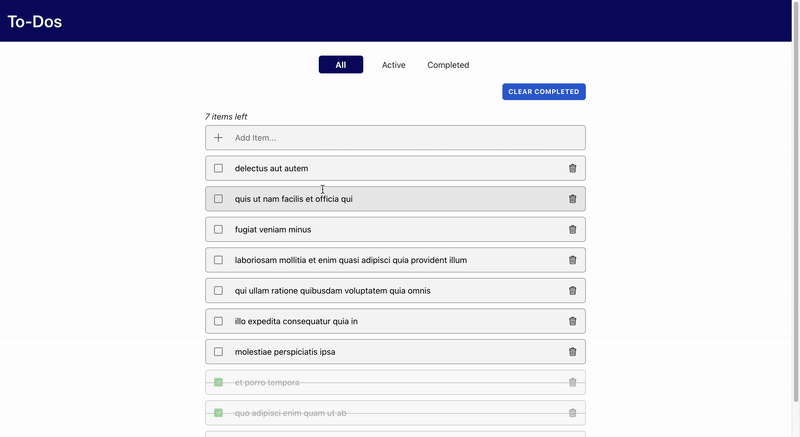

# To-Dos (for demo purpose)

  

## Project
For development, you will need Node.js (12.13.0+) and a node global package, NPM, installed in your environment.

## Key Libraries and Frameworks
- React
- Redux
- Redux Persist
- Reselect
- React Bootstrap

## Testing Framework
- Jest
- enzyme

## Quick Start
1. npm install
2. npm start

### Test
npm run test